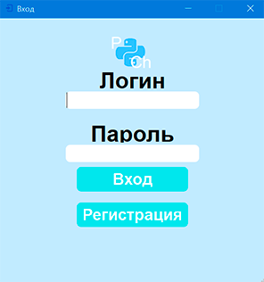
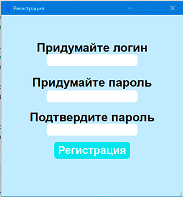
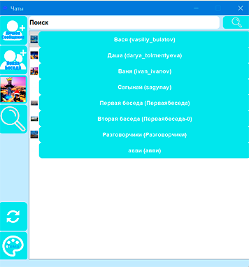
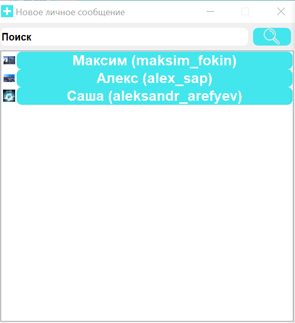
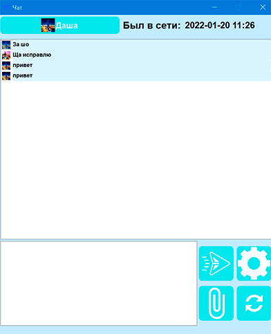
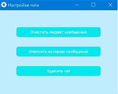
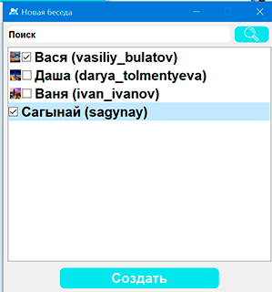
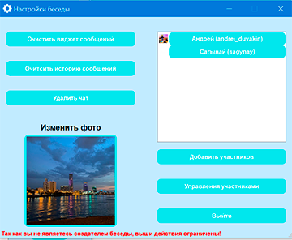
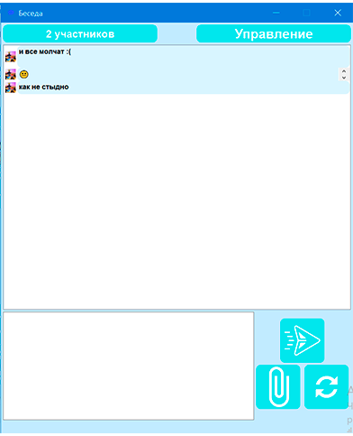
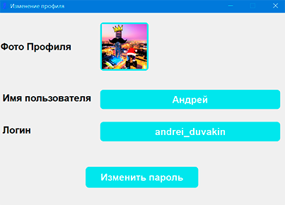

[🇬🇧 English](README.md)

# **PyChat**
Приложение для обмена сообщениями и файлами внутри локальной сети.

## Цель создания
Проект выполнен в рамках обучения в Лицее Академии Яндекса. Основная задача — на практике освоить создание клиент-серверного GUI-приложения с регистрацией пользователей, личными и групповыми чатами, передачей файлов и сменой тем оформления.

В окне авторизации нужно ввести, придуманный при регистрации логин и пароль. При наличии ошибки в данных выводится соответствующая ошибка. Если данные введены верно, то окно авторизации закрывается и открывается главное окно.

В главном окне представлена большая часть функционала программы. Нового пользователя встречает пустой список бесед и личных чатов. В левой части представлена главная панель с кнопками. Самая первая (верхняя) кнопка со значком плюса открывает новое окно со списком всех пользователей программы, кроме самого пользователя и тех с кем он уже ведет переписку, так же есть поле для ввода ключевых слов (поиска) и кнопка со значком лупы, которая активирует поиск. Список пользователей представляет собой список кнопок с именами пользователе, их логинами и фотографиями. Если ввести, какие либо ключевые слова в поиск и нажать на кнопку «поиск» список обновится и в нем останутся только пользователи соответствующие запросу. При нажатии на пользователя, окно закрывается в главном окне в список чатов добавляется соответствующий пользователь и открывается окно переписки с пользователем.

В нем мы можем увидеть историю сообщений, поле для ввода текста, кнопку отправки, обновления окна, настроек, информацию о последнем сеансе авторизации пользователя, и кнопку содержащую его имя и фотографию. При наборе текста и отправке в виджет добавляется соответствующее сообщение. Кнопка со значком скрепки «отправить файл», при нажатии открывается окно, в котором можно выбрать файл, при выборе файла, в виджет добавляется кнопка, при нажатии, на которую, если файл является изображением, то откроется окно, где можно просмотреть фотографию, а потом при необходимости сохранить. В ситуации со всеми остальными типами файлов, открывается окно, в котором мы можем выбрать директорию в которую сохраним файл. Кнопка с фотографией и именем собеседника  при нажатии открывает окно с информацией о пользователе (фотографией, именем, логином и кнопкой «написать сообщение»), Кнопка со значком шестеренки – «настройки» при нажатии открывается окно с тремя кнопка, мы можем очистить виджет (удалит только отображение сообщений), очистить историю (удалит все сообщения из переписки) и удалить чат (удалит пользователя из контактов, историю переписки, пользователь больше не будет отображаться на главном окне). Кнопка «обновить» обновляет виджет.

Вторая кнопка на главном окне «новая беседа», открывает окно со списком пользователей, с которыми мы уже ведем переписку, мы можем выбрать нужных нам пользователей поставив галочку и найти нужных пользователей из списка с помощью строки ввода ключевых слов и кнопки «поиск»
При нажатии на кнопку «создать» откроется окно, где мы должны ввести название беседы и при желании выбрать фото беседы. При нажатии на кнопку «создать» окно закроется, на главном окне в список чатов добавиться, созданная нами беседа, и откроется окно самой беседы, в нем мы увидим, поле для ввода текста, виджет отображающий сообщения, кнопку отправки сообщения, кнопку отправки файла, кнопку обновления, кнопку с числом участников и кнопку «управлять», кнопка с информацией о числе участников открывает окно со списком участников. Кнопка «управлять» открывает окно управления беседой, если вы не являетесь создателем беседы, то вы можете, только добавить новых участников, очистить виджет беседы или выйти из беседы. Если вы являетесь создателем беседы, вы можете изменить название беседы, очистить виджет беседы, очистить историю беседы, изменить фотографию беседы, удалить беседу, добавить новых участников, удалить из беседы нужных вам участников.
Третья кнопка главного окна имеет в себе фотографию профиля под, которым вы зашли, при нажатии открывается окно, в котором вы можете изменить фотографию своего профиля, имя пользователя и пароль.

Четвертая кнопка главного меню, позволяет находить любого пользователя программы. При нажатии на кнопку открывается список пользователей, в независимости от того, переписываетесь вы с кем либо или нет, вы можете осуществить поиск нужного вам пользователя, при нажатии на пользователя открывается окно и с информацией о пользователе (фото профиля, имя, логин).

Пятая кнопка главного меню, обновляет главное меню.

Шестая (нижняя) копка главного меню меняет тему на темную и обратно. При нажатии на кнопку, следует заново открыть остальные окна если такие есть, чтобы тема применилась и на них.

На главном виджете отображается список все личных переписок и бесед, в которых вы состоите. При нажатии на какой-либо элемент списка открывается окно в зависимости от элемента, который вы нажали, описываемые выше.

## **Контакты**
Почта - andreiduvakin@gmail.com

## Лицензия
MIT. См. файл [LICENSE](LICENSE).
